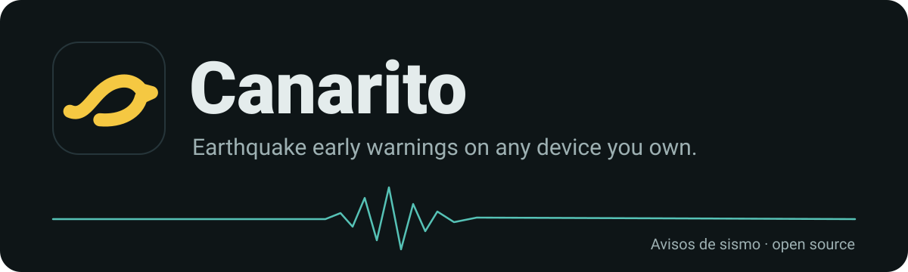
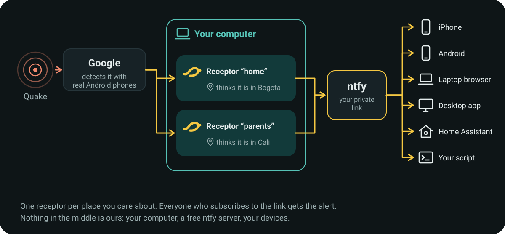
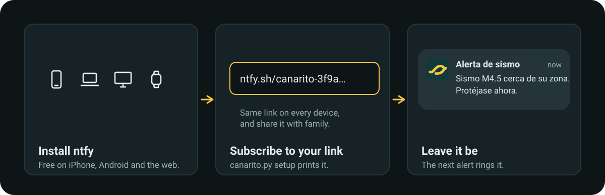
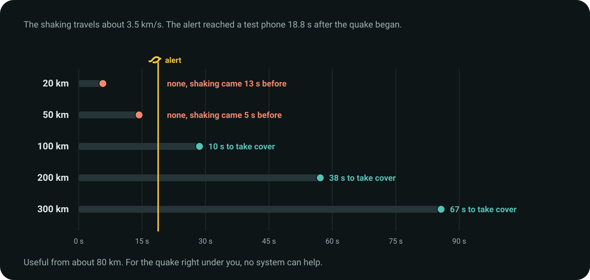

<p align="center">
  
</p>

Android phones get earthquake early warnings from Google. Canarito brings them to everything
else. It runs an Android emulator on your computer, tells it that it is at your home, and
sends its warnings to any device you subscribe: an iPhone, your mother's phone, a laptop, or
a light in Home Assistant.

> [!WARNING]
> Canarito is a hack around a system we don't own. It is not official, it breaks Google's
> terms, and it can miss an alert without telling you. Read [What can go wrong](#what-can-go-wrong).

## How it works

<p align="center"></p>

Google decides who gets an alert by the location the device reports, and an emulator with a
fake location is enough. In September 2026 real quakes in Colombia reached our emulators.
The ones inside the alert radius got the warning; the ones 478 km away got nothing.

You need no server. The emulator runs on your computer, and [ntfy](https://ntfy.sh), a free
push service, carries the alert to your devices. If you want everything under your control,
[run your own ntfy](https://docs.ntfy.sh/install/) and pass `--notify-url`.

## Start

You need macOS or Linux, Python 3.9 or newer, and the
[Android SDK command line tools](https://developer.android.com/studio#command-line-tools-only)
(`brew install --cask android-commandlinetools` on a Mac).

```bash
export ANDROID_HOME=/opt/homebrew/share/android-commandlinetools   # where yours is

python3 canarito.py setup --name home --lat 4.711 --lon -74.072    # your place, from any map
python3 canarito.py run --name home                                # leave it running
```

If you did not build the app, `run` downloads it from the
[v0.1.0 release](https://github.com/sebospc/canarito/releases/tag/v0.1.0) and installs it
only if its SHA-256 matches the one written in `canarito.py`. To build it yourself instead
(JDK 17): `echo "sdk.dir=$ANDROID_HOME" > local.properties && ./gradlew :android:assembleDebug`.
It is a debug build. Install it only in the emulator, never on your own phone.

The first `setup` downloads Android, a few GB. `run` boots the emulator in about two minutes,
but Google's earthquake code inside it takes 15 to 60 minutes more the first time. Wait for
the line `AEA registered` in the log. Before it, the receptor cannot get anything.

## Connect your devices

<p align="center"></p>

`setup` prints a private topic name such as `canarito-3f9a…`. In the ntfy app, tap **+**, type
that name and tap Subscribe. That is all "subscribe" means. You can do it from the ntfy app on [iPhone](https://apps.apple.com/app/ntfy/id1625396347) or
[Android](https://play.google.com/store/apps/details?id=io.heckel.ntfy), from
[ntfy.sh/app](https://ntfy.sh/app) in any browser, or from anything that can read a URL:
Home Assistant has an ntfy integration, and `curl -s ntfy.sh/<topic>/json` works in a
script. On Android, mark the subscription as urgent so it rings.

On iPhone, ntfy cannot ring through silent mode or Focus: Apple keeps that for official alert
apps. If you want something louder, a siren, a speaker or a light, subscribe it to the same
link. Anything that can read ntfy can act on the alert.

`setup` also prints an admin link, for whoever runs the computer. Canarito uses it on its own:
when the emulator stops answering, when Google's earthquake service does not start, when the
app could not be set up, and after the computer slept. It says so again when the problem
ends. Every 10 minutes it also checks the public quake catalogs (USGS and EMSC worldwide, plus
national ones such as Colombia's SGC where they exist) and reports any quake inside Google's
alert radius that reached no alert. Google uses its own magnitude, so a quake near the edge
is reported as "possibly missed". If coverage stays gone for an hour, the alert link gets one message too, so the family
knows. Never sign in to a Google account in the emulator: the one alert we lost with no
explanation was on an emulator signed in to a personal account.

`python3 canarito.py test --name home` sends a test message to both links and checks the
emulator.

<details>
<summary>More commands and options</summary>

| | |
|---|---|
| `canarito.py evidence --name home` | everything the app saw from Google, and every send, as JSON lines |
| `setup --name parents --lat … --lon …` | a second place. Each one is a full emulator, about 4 GB of RAM. |
| `--notify-url` | your own ntfy topic or server |
| `--admin-url` | your own ntfy topic for the admin link |
| `--notify-token` | ntfy access token, for a protected topic |
| `--heartbeat-url` | pinged every 5 minutes, for example by [healthchecks.io](https://healthchecks.io), which tells you when the receptor dies |
| `--language` | `es` (default) or `en` for the alert text |
| `--apk` | a prebuilt debug APK |

To keep it running after a restart of the computer, start `canarito.py run` from systemd or
launchd. With a self-hosted ntfy server, set `upstream-base-url: "https://ntfy.sh"` or
iPhones get the message late.

</details>

## Follow a person

A receptor can follow one person's phone instead of staying at a place:

```bash
python3 canarito.py setup --name ana --follow --lat 4.711 --lon -74.072   # where it starts
python3 canarito.py run --name ana
```

Ana subscribes ntfy to her own alert link, installs OwnTracks
([iPhone](https://apps.apple.com/app/owntracks/id692424691),
[Android](https://play.google.com/store/apps/details?id=org.owntracks.android)) and taps the
message Canarito sends her. OwnTracks then posts her position to a private location link, and
Canarito moves her receptor there after each move of more than 1 km, at most every 5 minutes.
Google itself takes a new location no more often than that.

When she has been within 5 km of a fixed receptor for 30 minutes, her receptor sleeps to free
its memory, and the fixed receptor also sends its alerts to her link. It wakes when she is
more than 5 km away, at her new place. Positions are rounded to about 1 km. On ntfy.sh they
pass through without being stored, but ntfy.sh sees them; `--location-url` points to your own
ntfy server instead.

Any app can feed the location link. The whole contract is one JSON message:

```json
{"lat": 4.711, "lon": -74.072}
```

<details>
<summary>Recipes: OwnTracks, Home Assistant, iPhone Shortcuts</summary>

- **OwnTracks**: `setup --follow` does it for you. On iPhone, first turn on "Allow
  external configuration" in OwnTracks' Settings, or it refuses the setup link with "URI or file
  configuration not allowed". Without the link: mode HTTP, URL = the location link. We tested the receptor side with messages in
  OwnTracks' format; a real phone has not been tested yet.
- **Home Assistant** (not tested yet): post the phone's position whenever it changes.

  ```yaml
  rest_command:
    canarito_ana:
      url: "https://ntfy.sh/canarito-where-...?cache=no"   # Ana's location link
      method: post
      payload: '{"lat": {{ state_attr("device_tracker.ana_phone", "latitude") }}, "lon": {{ state_attr("device_tracker.ana_phone", "longitude") }}}'
  automation:
    - alias: Canarito follows Ana
      trigger:
        - platform: state
          entity_id: device_tracker.ana_phone
          attribute: latitude
      action:
        - service: rest_command.canarito_ana
  ```
- **iPhone Shortcuts** (not tested yet): a personal automation, for example "when I leave
  home", that runs Get Current Location, then Get Contents of URL with method POST and a JSON
  body with `lat` and `lon` from that location.

Another app works too, as long as it sends that message. Pull requests with new recipes are
welcome.

</details>

### One computer for the family

Each receptor is a full emulator and uses about 4 GB of RAM. One computer can serve a family:
one fixed receptor for home, and one following receptor for each person who travels. A
following receptor sleeps while its person is home, so its memory is used only while they are
away. A 16 GB computer fits home plus two people away at the same time; an 8 GB one fits
home only. `setup` warns when the receptors would need more than 75% of the RAM.

## How much warning you get

<p align="center"></p>

Google's alert took 18.1 s and Canarito added 0.8 s. Google says that only 36% of its own
users get the alert before the shaking.

## What can go wrong

| risk | what happens |
|---|---|
| Google's terms | The emulator license covers app development only, and Google's data may not be redistributed without permission. Running this is your decision. |
| Google can stop it | Google's anti-abuse system reads the emulator's sensors. It did not block alerts in our tests, and you will get no notice if that changes. |
| Old location | On 24-Sep-2026 an emulator with a location about 25 hours old missed an alert. `run` reboots it every 18 hours, which leaves about 10 minutes without coverage each time. |
| AEA never starts | One in eight of our new emulators never registered. After 90 minutes the admin link tells you; delete that emulator and run `setup` again. |
| A following receptor trails | It moves at most every 5 minutes and Google takes a few minutes more, so the first minutes after a long trip can be uncovered. If OwnTracks stops sending, it stays at the last known place; after 6 hours without a position the admin link tells you. |
| Duplicates | A retry can deliver the same alert twice. We chose twice over never. |
| Public topics | Anyone who knows an ntfy.sh topic name can read it. `setup` picks a random name, so keep the link private. |
| Sleep | If the computer sleeps, the receptor stops. When it wakes, the admin link tells you for how long. Turn sleep off on that machine. |

<details>
<summary>Details behind each risk</summary>

- Android SDK License sections 3.1 and 3.4 allow the emulator "solely to develop
  applications"; section 8.1 forbids distributing data from Google APIs without permission.
  Google's Terms of Service forbid using its content without permission. The alert Canarito
  sends uses its own words, never Google's text or brand.
- Google's DroidGuard sampled the emulator's motion sensors while we watched. Delivery went on.
- Play Services takes a GPS fix some minutes into each boot and then keeps it. It updates the
  location at most every 5 minutes, and only after a move of more than 1 km. The app holds
  GPS open, and `run` feeds the position during every boot.
- Only the early warning goes out. The later notice (`eew_update`, which came 5 min 21 s after
  the quake on 24-Sep) would turn "take cover" into wrong advice. If Google renames its alert
  channel, Canarito stops sending rather than guess.
- The text has no distance, because Google's distance is from the emulator, not from you.
- Google's magnitude is its own estimate. A quake the Colombian Geological Service measured
  at M3.6 arrived from Google as M4.46.
- Google's alert radius is about 31 km for M4.5, 78 km for M5 and 346 km for M6, so an
  emulator far from you can stay silent during a quake you feel.

</details>

<details>
<summary>What we measured, 22-Sep to 7-Oct-2026</summary>

- 23-Sep, M4.5 near Chaparral, Colombia: the emulator 19.5 km away got the alert; three
  others 478 km or more away did not.
- 24-Sep, M4.48 near Chaparral: an emulator on a server in Brazil, with no Google account,
  got the early alert at +18.1 s. From the quake to a test phone took about 18.8 s.
- In 18 hours of sensor logs, Google's earthquake code never read the emulator's
  accelerometer, so the emulator does not help detect quakes.
- Google's alert radius follows a table by magnitude. Interpolating it matched the real radius
  within 0.4 km (median) on 69 Colombian alerts from Allen et al. 2025
  ([Zenodo 15498729](https://doi.org/10.5281/zenodo.15498729)). Depth barely changes it, which
  is why Bucaramanga, above a deep nest of quakes, gets the most alerts in Colombia.
- None of 65 Colombian alerts in three years was the full-screen kind.

</details>

## History

Canarito started in September 2026 as a paid iPhone app for Colombia and Chile, with a fleet
of emulators on AWS, a gateway to Apple's push service and a native iOS app. It stopped before
launch. A paid product had no answer to the terms problem, and the servers cost money every
month. This repository keeps the part one family can run alone.

Ideas nobody has built yet: read the emulator's real location age instead of rebooting every
18 hours, and run one receptor for a whole neighborhood. Official access to the alert feed,
from Google or a national seismological service, would make all of this unnecessary.

<p align="center"><sub>MIT license. Not affiliated with Google. Android Earthquake Alerts is a Google service. Display type: Bricolage Grotesque, SIL Open Font License.</sub></p>
