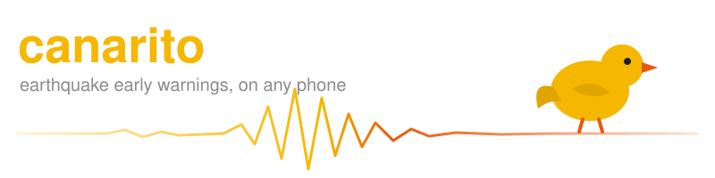
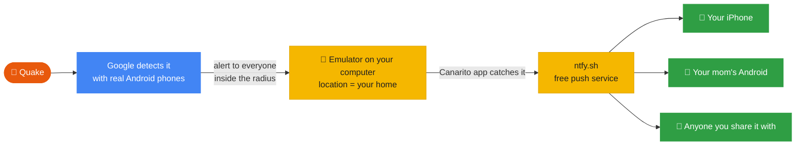
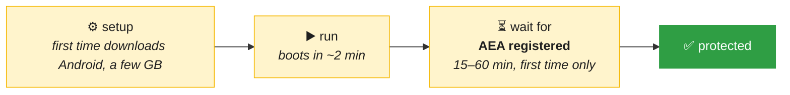

<p align="center">
  
</p>

<p align="center">
  
  
  
  
  
</p>

Android phones get earthquake early warnings from Google. **iPhones don't.** Canarito runs an
Android emulator on your computer, places it where you live, and sends its warnings to your
phone and your family's, iPhone or Android.

> [!WARNING]
> This is a hack around a system we don't own. It is not official, it breaks Google's terms,
> and it can miss an alert without telling you. Read [What can go wrong](#-what-can-go-wrong).

## 🐤 How it works



Google picks who gets the alert by the **location the device reports**. An emulator with a
fake location is enough. Proven with real quakes in Colombia, September 2026: emulators
inside the alert radius got it, the ones 478 km away did not.

What arrives on the phone:

<table><tr><td>

🚨 **Alerta de sismo**<br/>
Sismo M4.5 cerca de su zona. Protéjase ahora.

</td><td>

🚨 **Earthquake alert**<br/>
Earthquake M4.5 near you. Take cover now.

</td></tr></table>

## 🧰 Do I need a server?

**No.** Everything runs on your own computer, and Canarito sets it up.

| piece | who runs it | cost |
|---|---|---|
| 📱 Android emulator | `canarito.py`, on your computer | free, ~4 GB RAM |
| 🐤 Canarito app inside it | installed by `canarito.py` | free |
| 📡 Push to phones | [ntfy.sh](https://ntfy.sh) public server | free |
| 📲 Phone app | [ntfy](https://ntfy.sh) for iOS and Android | free |

The only thing you keep is a computer turned on. Want full control? Run your own
[ntfy server](https://docs.ntfy.sh/install/) and pass `--notify-url`.

## 🚀 Quick start

**You need:** macOS or Linux, Python 3.9+, the
[Android SDK command line tools](https://developer.android.com/studio#command-line-tools-only)
(`brew install --cask android-commandlinetools` on a Mac), and JDK 17 to build the app.

```bash
export ANDROID_HOME=/opt/homebrew/share/android-commandlinetools   # where yours is

# 1. Build the app that goes inside the emulator
echo "sdk.dir=$ANDROID_HOME" > local.properties
./gradlew :android:assembleDebug

# 2. Create a receptor at your place (lat, lon from any map)
python3 canarito.py setup --name home --lat 4.711 --lon -74.072

# 3. Start it and leave it running
python3 canarito.py run --name home
```

`setup` prints a private ntfy link like `https://ntfy.sh/canarito-3f9a…`. On each phone,
install ntfy and subscribe to it. That's it.



> [!IMPORTANT]
> Wait for the line `AEA registered` in the log. Until then, Google's earthquake code inside
> the emulator is not running and the receptor cannot get anything.

<details>
<summary><b>More commands and options</b></summary>

| command | what it does |
|---|---|
| `canarito.py test --name home` | sends a test message to your phones and checks the emulator |
| `canarito.py evidence --name home` | prints everything the app saw, as JSON lines |
| `setup --name parents --lat … --lon …` | a second place; each one is a full emulator |

| option | what it does |
|---|---|
| `--notify-url` | your own ntfy topic or server |
| `--notify-token` | ntfy access token, for a protected topic |
| `--heartbeat-url` | pinged every 5 min, e.g. [healthchecks.io](https://healthchecks.io). It tells you when the receptor dies. |
| `--language` | `es` (default) or `en` |
| `--apk` | use a prebuilt APK (must be the debug build) |

To survive a reboot of the computer, start `canarito.py run` from systemd (Linux) or launchd
(macOS). Self-hosted ntfy and iPhone: set `upstream-base-url: "https://ntfy.sh"` on the
server, or iPhones get the message late.

</details>

## ⏱️ How much warning do you get?

Google's alert reached our emulator **18.1 s** after the quake began. Canarito added **0.8 s**.
Shaking travels about 3.5 km/s, so it depends on how far you are:

| distance to the epicenter | warning |
|---|---|
| 🔴 20 km | none, shaking came 12 s before |
| 🔴 50 km | none, 3 s late |
| 🟡 100 km | ~11 s |
| 🟢 200 km | ~40 s |
| 🟢 300 km | ~68 s |

Useful from about **80 km**. For the quake right under you, no system can help. Google says
only 36% of its own users get the alert before the shaking.

## ⚠️ What can go wrong

| | risk | in short |
|---|---|---|
| ⚖️ | **Google's terms** | The emulator license is for app development only, and Google's data can't be redistributed without permission. Your call. |
| 🚫 | **Google can stop it** | Its anti-abuse system can tell emulators apart. Today it doesn't block alerts. Tomorrow, who knows. No warning when it changes. |
| 🧭 | **Old location, lost alert** | Happened on 24-Sep-2026 with a ~25 h old location. Canarito reboots the emulator every 18 h to avoid it: ~10 min without coverage each time. |
| 🐣 | **AEA never starts** | 1 in 8 of our new emulators never registered. `run` warns after 90 min: delete it and set it up again. |
| ❓ | **One unexplained miss** | An emulator with a personal Google account didn't get the early alert. One without an account, on a server, did. Never found why. |
| ✈️ | **It's the emulator's place, not yours** | Traveling? You still get alerts for home only. |
| 🔁 | **Duplicates** | A retry can deliver twice. Twice was chosen over never. |
| 🔓 | **ntfy.sh topics are public** | Anyone with the name can read and post. `setup` makes a random one: keep it private. |
| 😴 | **Sleeping computer = sleeping receptor** | Turn off sleep on that machine. |

<details>
<summary><b>The long version, with the details</b></summary>

- **License and terms.** Android SDK License 3.1 and 3.4 allow the emulator "solely to
  develop applications"; 8.1 forbids distributing data from Google APIs without permission.
  Google's Terms of Service forbid using its content without permission. Canarito sends its
  own words, never Google's text or brand.
- **Anti-abuse.** Google's DroidGuard reads the motion sensors to tell real devices from fake
  ones. We saw it sampling the emulator's accelerometer. It did not stop delivery.
- **Location.** Play Services takes a GPS fix some minutes into each boot and keeps it, and
  only updates it after a move of more than 1 km, at most every 5 min. The app holds GPS open
  and `run` feeds the position during every boot.
- **Only the early warning is sent.** The later "you may have felt shaking" notice
  (`eew_update`, 5 min 21 s after the quake on 24-Sep) is skipped: "take cover" would be
  wrong advice by then. If Google renames its alert channel, Canarito stops sending, on
  purpose. Guessing risks a false alarm.
- **No distance in the text.** Google's distance is from the emulator, not from you.
- **Google's magnitude is its own.** A quake the Colombian Geological Service measured M3.6
  came from Google as M4.46.
- **Alert radius.** About 31 km for M4.5, 78 km for M5, 346 km for M6. An emulator far from
  you may stay silent for a quake you feel.

</details>

## 🔬 What was measured

<details>
<summary><b>Lab results, 22-Sep to 7-Oct-2026</b></summary>

- **23-Sep, M4.5 near Chaparral, Colombia.** The emulator 19.5 km away got the alert; three
  others 478 km or more away did not.
- **24-Sep, M4.48 near Chaparral.** An emulator on a server in Brazil, with **no Google
  account**, got the early alert at +18.1 s. Origin to phone: ~18.8 s.
- **The emulator does not take part in detection.** In 18 hours of sensor logs, Google's
  earthquake code never read the accelerometer.
- **Google's alert radius is a lookup table by magnitude**, not a model: median error
  0.4 km over 69 Colombian alerts from Allen et al. 2025
  ([Zenodo 15498729](https://doi.org/10.5281/zenodo.15498729)). It barely accounts for depth,
  so Bucaramanga, on top of a deep nest of quakes, gets the most alerts in Colombia.
- **No full-screen alerts in Colombia.** 0 of 65 in three years, only normal notifications.

</details>

## 📜 History

Canarito started in September 2026 as a paid iPhone app for Colombia and Chile: a fleet of
emulators on AWS, a gateway pushing through Apple's servers, a native iOS app with a
subscription, built by one person with a team of AI coding agents.

It was dropped on **7-Oct-2026**, before launch. The terms problem had no good answer for a
paid product, the servers cost money every month, and the author needed to focus on another
project. What's left is the part that works for one family on their own computer, with no
server of ours in the middle.

**Ideas not done:** read the emulator's real location age instead of rebooting every 18 h; a
shared receptor for a whole neighborhood. And the real fix: official access to the alert
feed, from Google or a national seismological service.

---

<p align="center"><sub>MIT license · Not affiliated with Google · Android Earthquake Alerts is a Google service</sub></p>
